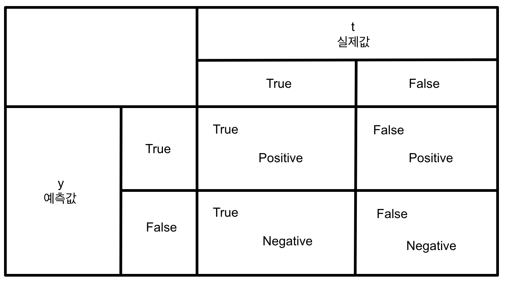

# Multiple Logistic Regression

이제 <code>Multiple</code>이란 단어는 사용하지 않을 것입니다. 왜냐하면 당연히 독립 변수가 여러 개인 <code>Multiple</code> 형태이기 때문입니다. 지금부터 알아볼 건 <code>Logistic Regression</code>입니다.

<code>Logistic Regression</code>는 데이터가 바뀐, 다시 말해 독립 변수가 아닌 종속 변수의 형태가 바뀐 것을 의미합니다. 아래는 간단한 예시입니다.

<pre>
시간    연수    합격여부
x1     x2       t
--------------------
1       1       0
3       1       0
2       3       1
10      1       1 
5       2       1
</pre>

이처럼 <code>t data</code>가 0과 1로 돼 있으면 <code>Linear Regression</code>으로 해결할 수가 없습니다. 이런 것을 <code>binary classification</code>이라고 합니다. 이 문제를 처음에는 <code>Linear Regression</code>으로 해결하려고 노력해 봤지만 안 됐습니다. 그럼 어떻게 하면 될까요? <code>Sigmoid</code>라는 수학 식(<code>1 / (1 + exp(-x))</code>)이 있는데, 이를 이용해 모델을 만들면 된다고 생각을 하게 됩니다.

앞에서 작성한 식(<code>1 / (1 + exp(-x))</code>)의 <code>x</code>에 <code>Linear Regresiion Model</code>을 밀어넣어 새로운 수학식을 만들어 새로운 모델을 만들어 냅니다.

기존 <code>Linear Regression</code>은 모델 <code>y = xw + b</code>의 식에서 더욱 좋은 예측치를 출력하려는 것이 목적입니다. 그 예측치가 좋은지 아닌지는 저희가 가지고 있는 실제값이랑 비교를 하는 것이고, 그 비교하는 것을 <code>loss</code>라고 합니다. 그리고 그 <code>loss</code>로 <code>MSE</code>를 사용합니다.

<code>Logistic Regression</code>은 모델이 <code>y = 1 / 1 + e^-(xw + b)</code> 식의 형태를 가지고 있습니다. 이 모델 역시 예측치와 실제값을 비교해보려 시도했지만 그것에 실패한 것이고요. 하지만 저희는 <code>loss</code>를 계산하긴 해야 하기 때문에 <code>MSE</code>가 아닌 다른 수식을 찾고자 합니다. 그 수식이 <code>Cross Entropy</code>입니다. 수식은 <code>y = - Σi p(xi) * log(q(xi))</code>로 나타낼 수 있습니다.

예측치는 0과 1 사이의 값이 나오게 됩니다. 만약 0.3이 나온다면 1이 될 확률이 30%, 0.7이 나온다면 1이 될 확률은 70%로 볼 수 있습니다. 즉, 예측치는 확률값으로 나오게 됩니다.

```py
# [Logistic Regression]

# 1. 모듈 임포트
import numpy as np # 넘파이
import pandas as pd # 판다스
from sklearn.preprocessing import MinMaxScaler # 정규화 위해, 사이킷 런이 가지고 있는 민맥스 스케일러 임포트
from tensorflow.keras.models import Sequential # 모델
from tensorflow.keras.layers import Flatten, Dense # 레이어(기둥(인풋과 아웃풋))
from tensorflow.keras.optimizers import Adam # 옵티마이저
from scipy import stats
```

```py
# 2. 로우 데이터 로딩 + 데이터 전처리
# 데이터 전처리는 세 개 진행
# 1) 결측치
# 2) 이상치
# 3) 정규화

df = pd.read_csv('./data/admission.csv')
display(df, df.shape) # (400, 4)

# 1) 결측치 처리
# print(df.info()) # info()로 결측치 확인 가능

# 2) 이상치 처리
# 가장 대표적인 방법은 두 가지
# (1) Tukey Fence(4분위 이용)
# (2) Z-Score 방식(정규분포 이용)
# 여기서는 (2)번 사용. Z-score 방식으로 이성치 걸러내 사용
zscore_threshold = 2.0 # zscore outliers 임계값 (2.0이하가 optimal)


for col in df.columns:
    outliers = df[col][(np.abs(stats.zscore(df[col])) > zscore_threshold)]
    df = df.loc[~df[col].isin(outliers)]
    
# print(df.shape)  # (382, 4)

# 3) 정규화 진행
scaler = MinMaxScaler()
scaler.fit(df[['gre', 'gpa']].values) # 데이터프레임을 구성하고 있는 2차원 넘파이 어레이를 출력 -> scaler에게 전달
```

```py
# 3. 트레이닝 데이터 셋
# 데이터를 준비하는 이 단계에서부터 머신러닝 시작
# 1) x_data, t_data
x_data = scaler.transform(df[['gre', 'gpa']].values)
t_data = df['admit'].values.reshape(-1, 1)

# 2) 모델
model = Sequential()

# 3) 모델에 레이어 추가
model.add(Flatten(input_shape=(2, )))
model.add(Dense(1, activation="sigmoid")) # 예전엔 linear

# 4) 모델 설정
model.compile(optimizer=Adam(learning_rate=1e-4),
             loss='binary_crossentropy')

# 5) 모델 학습
model.fit(x_data, t_data, epochs=2000, verbose=0)
```

```py
# 4. 모델 평가
```

```py
# 5. 모델 예측
# 성적 550, 3.5일 때 합격 여부
predict_data = np.array([[550.0, 3.5]])
scaled_predict_data = scaler.transform(predict_data)
result = model.predict(scaled_predict_data) # 0.34.. -> 약 34%
print(result)
```

## Evalueation
> 평가

<code>Logistic Regression</code>으로 넘어가면서, 평가를 진행하게 됩니다. <code>Linear Regression</code>도 평가를 진행해야 하지만, 보통 <code>Logistic Regression</code>으로 넘어가면서 평가 이야기가 나오는 편입니다.

### 1. 평가 방법(데이터 관점)

<code>Training Data Set</code> 우리가 가지고 있는 데이터를 의미합니다. 위 예제를 기준으로 약 400개가 있다고 가정해 보겠습니다. 이를 일반적으로 7:3 혹은 8:2 비율로 데이터를 자릅니다. 이때 7 혹은 8 비율을 학습 데이터(<code>Training Data Set</code>), 나머지 비율을 시험 데이터(<code>Test Data Set</code>)이라고 합니다. 시험 데이터는 최종 단계에서 딱 한 번 사용합니다.

7의 비율 중, 또 약 7:3 정도로 나눠, 7이 <code>Training Data Set</code>, 나머지를 <code>Validation Data Set</code>라고 합니다. <code>Validation Data Set</code>은 학습이 진행되면서 학습이 잘 진행되는지 아닌지를 확인하기 위한 평가용 데이터 셋을 의미합니다.

### 2. 평가 기준(Metric)



이를 <code>Confusion Matrix</code>라고 합니다.