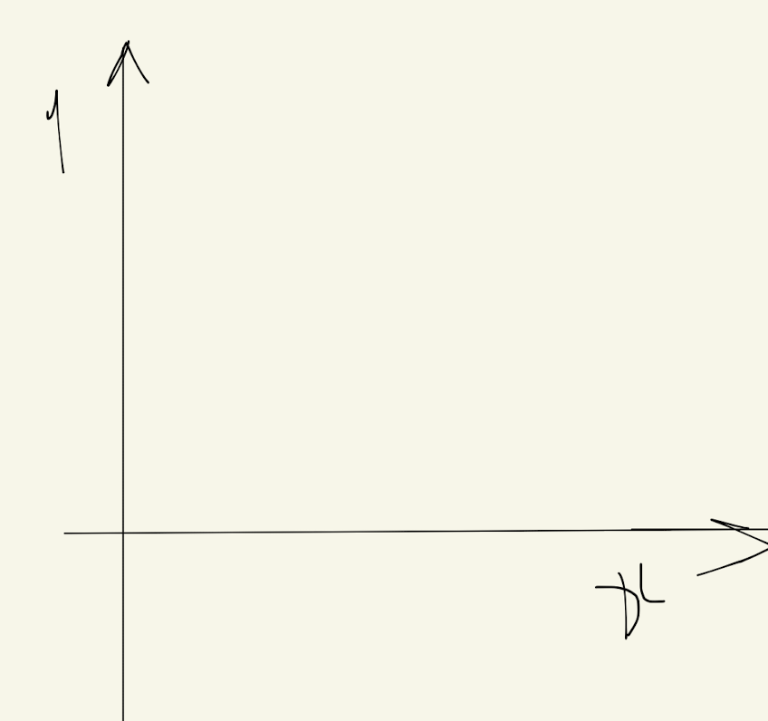
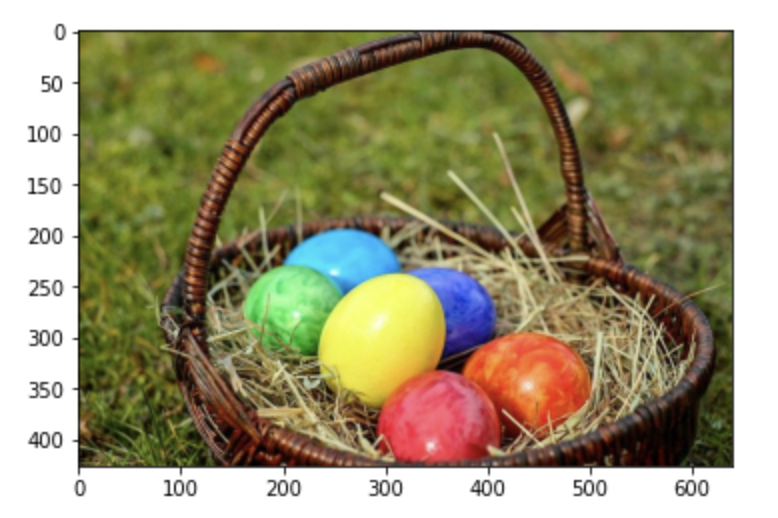

# CNN(Convolutional Neural Network)

## 이미지 파일에 대해 기억해야 할 것

### 좌표계

#### 일반적인 좌표계
> 데카르트 좌표계

#### 이미지는 이미지 좌표계가 따로 존재

### 이미지는 3차원이다

이미지는 흑백과 컬러를 포함해서 기본적으로 3차원 데이터입니다. 3차원 데이터라는 의미는 가로와 세로, 컬러로 구성돼 있다는 것을 의미합니다.

## Convolutional Neural Network
> 합성곱 신경망

비정형 데이터의 가장 대표적인 이미지를 학습하려면 <code>CNN</code> 알고리즘을 활용할 수 있습니다. <code>CNN</code>은 컨브넷(<code>Convnet</code>)이라고 축약해 표현하기도 합니다.

그럼 이를 사용해 어떻게 이미지 데이터 학습이 가능한 걸까요? 다이어그램으로 비교해 보면 다음과 같습니다.

### DNN

### CNN

일반적으로 3X3 크기의 <code>Filter</code>를 사용해 1칸씩 이동하며 합성곱을 진행합니다. 이 <code>Filter</code>는 <code>Kernel</code>이라고도 부르며, 1칸 이동할지 2칸 이동할지 등 이동하는 간격을 <code>Stride</code>라고 합니다. 스트라이드가 크면 클수록 즉 이동하는 간격이 넓을수록 <code>Convolution</code>이 작을 수밖에 없습니다.