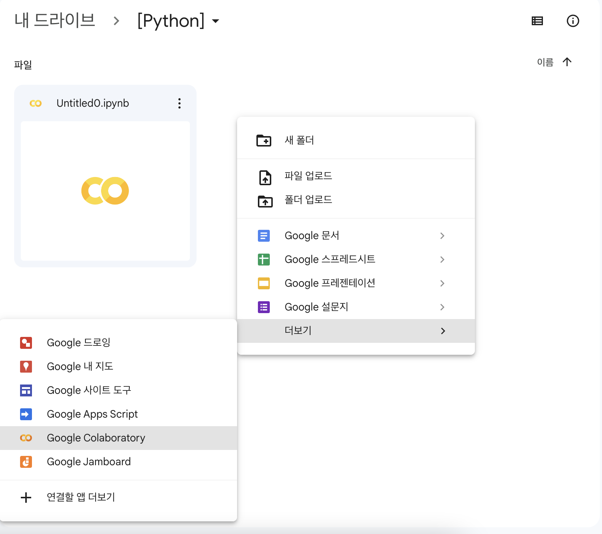
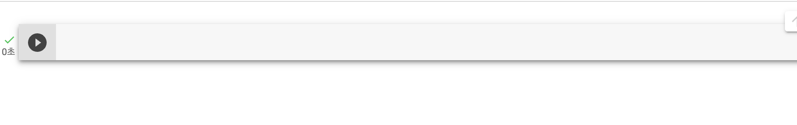
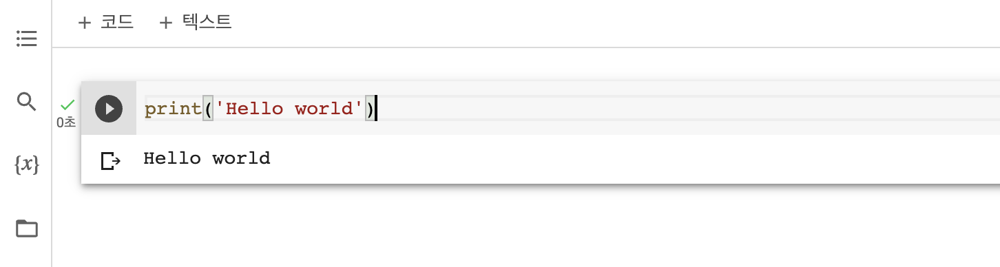
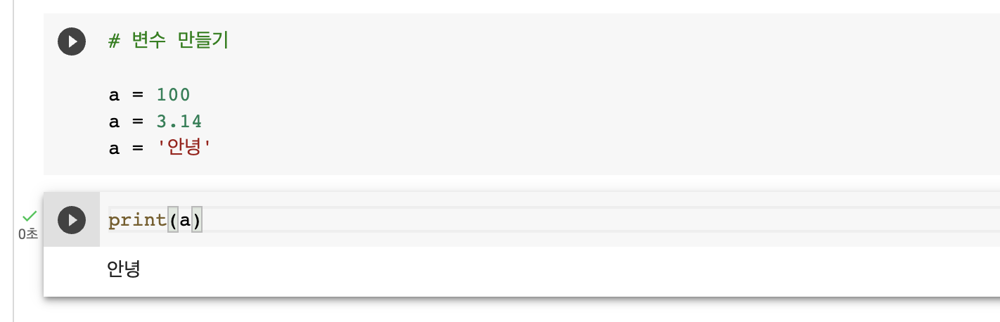

# 파이썬 개발 환경

기존 자바는 JDK를 설치하고 이클립스나 인텔리제이, STS 개발 툴을 설치해 사용했습니다. 이는 파이썬도 마찬가지입니다. 파이썬은 파이참(<code>pycharm</code>)과 장고(<code>Django</code>)를 사용해 개발합니다.

## 주피터 노트북

현재 수업에서는 주피터 노트북(<code>Jupyter Notebook</code>)이란 웹 기반의 개발 툴을 사용해 개발합니다. 이를 사용해 데이터 분석과 머신러닝, 딥러닝을 할 계획입니다. 

## 코랩

주피터 노트북을 사용하는 방법은 두 가지가 있습니다. 로컬에 설정하거나 코랩(<code>CoLab</code>)이라는 클라우드 기분 주피터 노트북 환경을 사용합니다. 현재 수업에서는 처음에는 로컬에 설정해 개발을 하다 이후 코랩을 이용해 주피터 노트북을 사용할 예정입니다.

### 생성

구글 드라이브 접속 후 폴더 안에서 우클릭 후 더 보기, <code>Google Colaboratory</code> 클릭해 생성해 줍니다.



### 셀(Cell)

코드를 작성하는 박스를 <code>Cell</code>이라고 합니다. 



### 코드 실행

<code>Cell</code>을 실행하려면 <code>Ctrl + Enter</code>로 실행합니다.



### 단축키

```python
# 코드 셀 위에 삽입
  # Command + M + A
# 코드 셀 아래에 삽입
  # Command + M + B
# 코드 셀 삭제
  # Command + M + D

# 실행 후 커서 해당 셀
  # Command + Enter
# 실행 후 커서 다음 셀
  # Shift + Enter
```

### 메모리 공유



## 아나콘다 플랫폼

### base

base라는 가상 곤간이 있음 A는 웹 개발을 하고, B는 데이터 분석, C라는 공간에는 AI, ML, DL 등을 작업할 수 있습니다.

### 환경 설정

아래 3개의 라이브러리와 1개의 개발 환경을 설치해야 합니다.

- 라이브러리
  - Numpy
  - Pandas
  - Matplotlib
- 개발 환경
  - nb_conda

#### 설치

```bash
# conda는 아나콘다 명령어

# 설치
conda create -n data_env python=3.8 opensslcon

# 이동
conda activate data_env

# 넘파이 설치
conda install numpy

# 판다스 설치
conda install pandas

# 맷플롯립
conda install matplotlib

# NB콘다
conda install nb_conda
```

#### 설정

```bash
# 1. 주피터 노트북 설정파일 생성
jupyter notebook --generate-config

# 2. 설정파일 jupyter_notebook_config.py 경로 확인

# 3. 설정파일 연 뒤 저장 경로 수정
c.NotebookApp.notebook_dir = '/Users/seungjeon/Desktop/MyFolder/Dev/AI'

# 4. 설정파일 저장

# 5. 주피터 노트북 실행
jupyter notebook

```