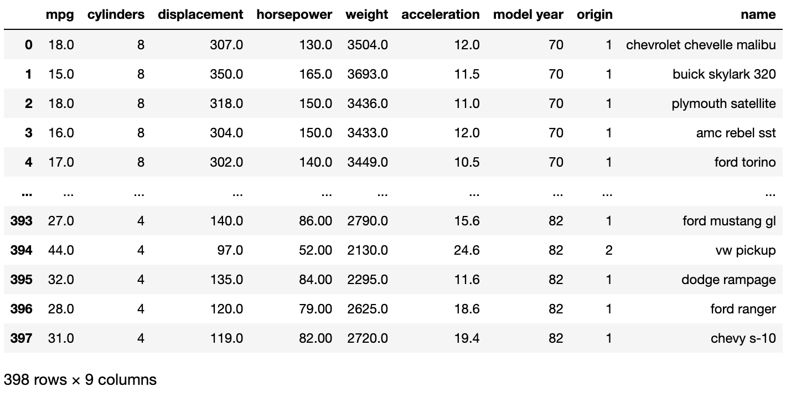
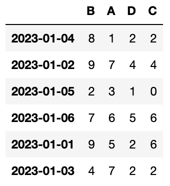
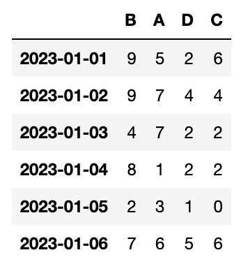
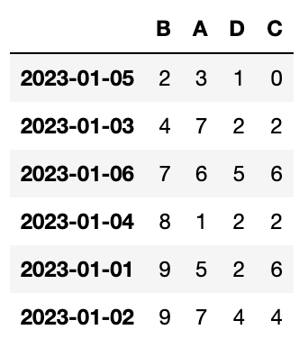

# 데이터프레임 함수
> 데이터프레임에서 제공하는 함수 중 꼭 알아야 하는 함수 짚고 가기

## 데이터프레임 생성

```py
import numpy as np
import pandas as pd

# 헤더가 없으면 header=None
# 안 그러면 1행이 헤더 자리에 삽입됨
df = pd.read_csv('./data/auto-mpg.csv', header=None) 
df.columns = ['mpg', 'cylinders', 'displacement', 'horsepower',
              'weight', 'acceleration', 'model year', 'origin', 'name']
display(df)
```



## 1. head(), tail()

```py
import numpy as np
import pandas as pd

# head() -> 상위 n개
# tail() -> 하위 n개
# default -> 5개
display(df.head(3)) 
```

## 2. count()

```py
# 이제부터 넘파이, 판다스 임포트 생략
print(df.count())
```

기본적으로 머신러닝에 사용되는 데이터는 결측치가 존재하면 안 됩니다. 여기서 결측치란, 기계의 결함이나 사람의 실수 등을 포함해 데이터가 없는 것을 의미합니다. 즉 이런 결측치는 수정을 하거나 삭제를 해서 꼭 찾아 처리해야 합니다. 이러한 수행을 <code>count()</code>가 해 줍니다.

## 3. value_counts()

```py
# Sereis에 적용하는 함수. 중복값 제거
df['model year'].unique()
```

## 4. unique

```py
# Sereis에 적용하는 함수. 중복값 제거
df['model year'].unique()
```

## 5. isin


## 6. 난수

```py
# ndarray를 만들 때 난수 이용해 만들 수 있음
# np.random.randint(0, 10, (6, 4)) # 0부터 9까지, 6X4의 2차원 배열 만들어 줌

np.random.seed(1) # seed를 설정하면 항상 같은 난수를 생성할 수 있다
np.random.randint(0, 10, (6, 4)) # 0부터 9까지, 6X4의 2차원 배열 만들어 줌
```

## 7. sort()

```py
import numpy as np
import pandas as pd

df = pd.DataFrame(np.random.randint(0, 10, (6, 4))) # 0부터 9까지 6X4 배열로 랜덤하게 난수 발생
df.columns = ['A', 'B', 'C', 'D']                   # column을 지칭
df.index = pd.date_range('20230101', periods=6)     # index를 지칭

random_date = np.random.permutation(df.index)       # 랜덤하게 index 조정
df2 = df.reindex(index=random_date, columns=['B', 'A', 'D', 'C'])
display(df2) # 1번 사진

# 인덱스로 정렬
display(df2.sort_index(axis=1, ascending=True)) # 2번 사진
display(df2.sort_index(axis=0, ascending=True)) # 3번 사진

# 값을 가지고 정렬
display(df2.sort_values(by=['B', 'A']))         # 4번 사진
```






