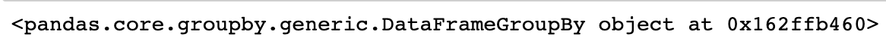
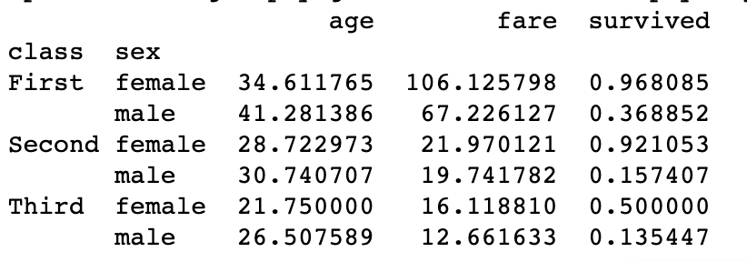

# 그룹핑

```py
import numpy as np
import pandas as pd
import seaborn as sns

titanic = sns.load_dataset('titanic')
display(titanic)
```

```py
grouped = df.groupby(['class', 'sex'])
print(grouped) # 1번 이미지
print(grouped.mean()) # 2번 이미지

group4 = grouped.get_group(('Third', 'female'))
display(group4) # 3번 이미지 
```





