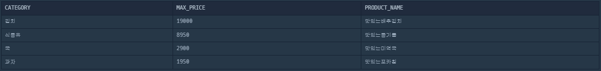
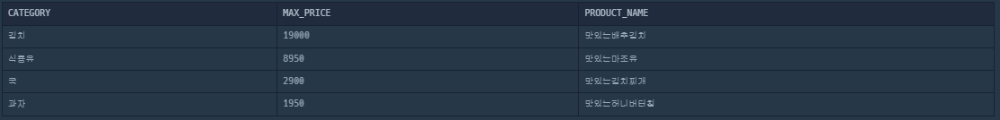

# 즐겨찾기가 가장 많은 식당 정보 출력하기

## 문제

https://school.programmers.co.kr/learn/courses/30/lessons/131123

## 코드

```sql
SELECT FOOD_TYPE, REST_ID, REST_NAME, FAVORITES
FROM REST_INFO
WHERE (FOOD_TYPE, FAVORITES) IN (
    SELECT FOOD_TYPE, MAX(FAVORITES) 
    FROM REST_INFO
    GROUP BY FOOD_TYPE
)
ORDER BY FOOD_TYPE DESC
```

## 풀이

SUB QUERY와 GROUP BY 절로 풀이가 가능합니다.

처음에는 아래 쿼리처럼 WHERE 절에서 MAX(FAVORITES)만 가져오면 해결이 될 줄 알았는데, 이를 메인 쿼리로 실행할 땐 결과값이 잘 출력되는데, WHERE 절에서는 그렇지 않습니다.

```sql
SELECT FOOD_TYPE, REST_ID, REST_NAME, FAVORITES
FROM REST_INFO
WHERE FAVORITES IN (
    SELECT MAX(FAVORITES) -- FOOD_TYPE 제거 
    FROM REST_INFO
    GROUP BY FOOD_TYPE
)
ORDER BY FOOD_TYPE DESC
```

이 쿼리의 서브 쿼리는 각 FOOD_TYPE에 대한 최대 FAVORITES 값을 반환합니다. 예를 들어, 서브쿼리의 결과가 10, 15, 20이라고 하면, 메인 쿼리는 FAVORITES 값이 10, 15, 20인 모든 레코드를 선택합니다.

하지만 문제는 이렇게 선택된 레코드들이 원래 해당 FOOD_TYPE에 대한 최대 FAVORITES 값을 갖는 레코드인지를 보장하지 않습니다. 즉, 다른 FOOD_TYPE의 레코드가 같은 FAVORITES 값을 가질 경우, 그 레코드도 선택될 수 있습니다.

서브 쿼리를 메인 쿼리로 실행할 때는 각 FOOD_TYPE에 대한 최대 FAVORITES 값을 정확하게 보여줍니다. 그러나 메인 쿼리와 함께 서브 쿼리로써 실행할 때, 반환되는 FAVORITES 값들과 매치되는 모든 레코드를 가져오기 때문에 의도하지 않은 결과가 나올 수 있습니다.

이를 해결하려면  (FOOD_TYPE, FAVORITES) 쌍을 사용하여 서브쿼리의 결과와 메인 쿼리의 레코드를 비교해야 합니다.

# 식품분류별 가장 비싼 식품의 정보 조회하기

## 문제 

https://school.programmers.co.kr/learn/courses/30/lessons/131116

## 코드

```sql
SELECT CATEGORY, PRICE AS MAX_PRICE, PRODUCT_NAME
FROM FOOD_PRODUCT
WHERE (CATEGORY, PRICE) IN (
    SELECT CATEGORY, MAX(PRICE) AS MAX_PRICE
    FROM FOOD_PRODUCT
    WHERE CATEGORY IN ('과자', '국', '김치', '식용유')
    GROUP BY CATEGORY)
GROUP BY CATEGORY
ORDER BY PRICE DESC
```

## 풀이

문제를 읽자마자 작성한 쿼리문인데 이는 통과하지 못 했습니다.

```sql
SELECT CATEGORY, MAX(PRICE) AS MAX_PRICE, PRODUCT_NAME
FROM FOOD_PRODUCT
WHERE CATEGORY IN ('과자', '국', '김치', '식용유')
GROUP BY CATEGORY
ORDER BY PRICE DESC
```

다음 쿼리문의 실행 결과는 아래 이미지와 같습니다.



그리고 정답인 쿼리문의 실행 결과는 아래 이미지와 같습니다.



둘의 결과는 차이가 있는데요. 바로 PRODUCT_NAME이 제대로 매핑이 안 된다는 것입니다. 처음 쿼리문의 실행 순서는 다음과 같습니다.

1. CATEGORY로 그룹핑을 한 뒤
2. 임의의 PRODUCT_NAME을 SELECT 해 옴

따라서 CATEGORY로 그룹핑 한 최대 가격과 제품의 이름이 일치하지 않는 오류를 야기합니다.

하지만, 두 번째(정답) 쿼리문의 실행 순서는 다음과 같은데요.

1. 서브 쿼리에서 카테고리 별 최대 가격을 구함
2. 구한 데이터에서 카테고리, 가격, 제품 이름을 가져옴

따라서 첫 번째 경우 문제를 통과할 수 없었으며, 두 개의 쿼리문을 비교해 차이점을 알아볼 수 있었습니다.