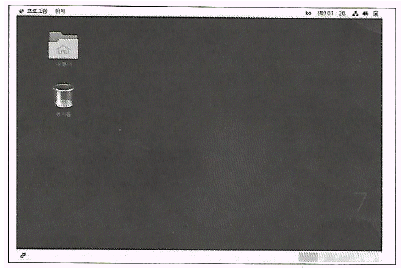

# 리눅스 마스터 2급 2023 03 기출 문제

## 1과목

9. 다음 중 현재 마운트 된 디스크의 사용량을 확인할 때 사용하는 명령어로 알맞은 것은?
답. df

10. 리눅스에서 파티션을 생성하면 고유한 이 값이 부여되는데, 이 값을 (ㄱ)라고 부르고, 이 값을 확인할 때는 (ㄴ) 명령어를 사용한다.
답. ㄱ. uuid ㄴ. blkid

11. 다음 중 등장한 시기가 오래된 쉘로 알맞은 것은?
답. bourne shell
bourne shell > csh > tsch > ksh > bash

12. 다음 중 특정 사용자에게 부여된 로그인 쉘이 기록된 파일명으로 알맞은 것은?
답. /etc/passwd
/etc/shells: 시스템에서 사용 가능한 쉘 목록을 포함하고 있는 파일
/etc/passwd: 특정 사용자에게 포함된 로그인 쉘

13. 다음 중 이용할 수 있는 쉘의 정보를 확인할 때 사용하는 명령어로 알맞은 것은?
답. chsh -l

14. 다음 중 사용자의 로그인 쉘이 저장되는 환경 변수명
답. SHELL
LOGIN: 로그인 세션을 나타내는 쉘 환경변수
USER: 현재 사용자 이름을 나타내는 환경변수
SHELL: 현재 사용 중인 쉘 경로를 나타내는 환경변수
BASH: bash 쉘에 대한 정보를 나타내는 환경변수

15. 다음 중 최근 실행한 명령 중 'al'로 끝나는 명령을 찾아 실행하는 명령어
답. !?al
문제 오류로 전원 정답 처리 된 문제

16. 다음 중 시스템 전체 사용자에게 적용되는 한경변수 및 시작 관련 프로그램 설정 시 사용하는 파일
답. /etc/profile
/etc/bashrc: 별칭과 Bash가 실행하는 함수 제어
~/ .bashrc: 별칭과 Bash가 실행하는 함수를 지역적으로 제어
~/ .bash_profile: 개별 사용자의 쉘 환경 제어하는 지역 설정 파일

~/ 이게 지역적으로 접근하는 건가...?

17. 명령 행에서 이름이 긴 파일명을 입력할 때 앞 글자만 입력하고 Tab 키를 눌러 나머지 부분을 불러오는 기능
답. 명령행 완성 기능

18. 프롬포트 변경 시 사용하는 환경변수
```bash
[ihduser@www ~] $
```
답. PS1

19. CentOS 7 리눅스에서 부팅을 시작하면 커널이 (ㄱ)라는 최초의 프로세스를 발생시키고 PID는 (ㄴ)를 부여한다.
답. ㄱ. systemd, ㄴ. 1
init은 시스템이 종료될 때까지 계속 실행하는 데몬 프로세스

20. 기존 프로세스를 교체하면서 새로운 프로세스를 발생시키는 과정
```bash
$(괄호) ps -l
```
답. exec

21. jobs: 작업이 중지된 상태, 백그라운드로 진행 중인 상태, 변경 되었지만 보고되지 않은 상태 표시

22. SIGHUP의 시그널 번호
답. 1

23. 주기적이고 지속적인 서비스 요청을 처리하기 위해 계속 실행되는 프로세스
답. daemon

24. 프로세스명을 인자값으로 사용하는 명령어의 조합
답. killall, nice
kill, renice는 pid(프로세스 아이디)를 인자값으로 받음

25. 매주 토요일과 일요일 오전 4시 1분에 주기적으로 실행
답. 1 4 * * 0,6 /etc/backup.sh

26. pid가 1222인 bash 프로세스 우선순위(NI) 값이 0이다. 다음 중 이 프로세스의 NI 값을 10으로 우선순위 변경하는 것은?
답. nice -10 bash
nice -우선순위 프로세스명

27. "작업이 종료되었으나 부모 프로세스로부터 회수되지 않아 메모리를 차지하고 있는 상태"의 상태 코드값
답. Z
<pre>
ps 명령어 프로세스 상태코드값
D: IO와 같이 중지 시킬 수 없는 잠자고 있는 프로세스 상태
R: 실행 중이거나 실해 가능한 프로세스 상태
S: 잠자고 있지만 중지시킬 수 있는 프로세스 상태
T: 작업 제어 신호에 의해 중지된 상태
t: 디버거에 의한 추정 중 중지된 상태
X: 죽은 프로세스 상태
Z: 좀비 프로세스 상태
</pre>

28. 포어그라운드 프로세스를 백그라운드 프로세스로 전환하기 위해 사용하는 키 조합
답. Ctrl z

29. 리처드 스톨만이 개발한 고성능 문서 편집기
답. emacs
<pre>
gedit: GNONE 데스크탑 환경에 개발된 sw
vim: 브람 무레나르
emacs: 리처드 스톨만
vi: 빌조이(버클리 공대)
pico: MIT 대학에서 UNIX 기반 에디터로 개발
</pre>

30. nano 편집기에서 프로그램을 종료하는 키 조합
답. Ctrl x
<pre>
Ctrl a: 행의 맨 앞으로 커서 이동
Ctrl e: 행의 맨 끝으로 커서 이동
Ctrl c: 현재 커서 위치에 ascii 값 표시
Ctrl x: 나노 편집기 종료
</pre>

31. X 윈도 환경에서만 실행되는 편집기
답. gedit

32. vi 편집기로 파일 불러올 때 커서를 파일 가장 마지막 줄에 위치
```bash
vi () lin.txt
```
답. +
<pre>
-c: 특정 명령어 실행
-r: 이전 편집 중이던 파일 중단되거나 충돌로 인해 손실된 경우 복구
-R: 읽기 전용 모드
+: 파일을 열면서 커서를 특정 위치에 놓을 때 사용
</pre>

33. set ai(AutoIndent): vi 편집기에서 자동으로 들여쓰기와 행 바꿈 기능

34. vi 편집기에서 커서 키가 없는 자판 이용 시 아래 방향으로 이동하기 위한 명령어
답. j
<pre>
-h: 커서를 한 칸 왼쪽으로 이동
-j: 커서를 한 줄 아래로 이동
-k: 커서를 한 줄 위로 이동
-l: 커서를 한 칸 오른쪽으로 이동
</pre>

35. 수세 리눅스에서 사용되는 패키지 관리 도구 모음
답. YaST, zypper
배포판 별 패키지 관리 기법
<pre>
배포판      기본 패키지 관리 기법           온라인 패키지 관리 기법
레드햇          RPM                             YUM
데비안          Dpkg                            apt-get
수세            YaST                            zypper
</pre>


36. 데비안 리눅스에서 사용하는 curses 메뉴 방식의 도구로, 커서를 사용해 주어진 메뉴를 이동하면서 손쉽게 패키지 관리

dselect

37. 
```bash
dpkg -i vim_4.5-3.deb
```

dpkg -i 패키지명.deb: 데비안 계열 리눅스에서 .deb 패키지 설치 명령어

38. Makefile 파일을 읽어 들여서 타깃과 의존성 관련 작업 수행
make
configure: 환경파일 makefile 생성
make: makefile 기반으로 소스 파일 컴파일 등~
cmake: 플랫폼 별 빌드 파일 생성
make clean: 빌드 디렉터리 정리

39. text.tar에 묶인 파일 내용 확인
```bash
tar tvf text.tar
```

tar tvf 파일명: 파일에 묶인 내용 확인

40. 대용량 파일 백업 시 압축 효율성 좋은 순서
.xz > .bz2 > .gz > .Z

41. 
rpm -ql: 패키지가 설치한 설치 파일 목록 출력
rpm -qa: 시스템에 설치된 모든 패키지 정보 출력
rmp -qip ~.rpm: 패키지 파일에 대한 정보를 출력
rpm -qV: 패키지 검증

42. yum 명령어로 nmap 패키지를 제거하는 명령어
```bash
yum remove nmap
```
yum -d, yum delete 다 아님

43. CentOS 7에서 X 윈도 기반 프린터 설정 시 명령어
system-config-printer

44. 초기 리눅스에서는 사운드 카드를 사용하기 위해 표준 유닉스 장치 시스템 콜을 사용하는 (ㄱ)을 이용했으나 사유화되면서 (ㄴ)으로 전환되었다.
ㄱ. OSS, S.ALSA

45. 리눅스에서 프린터 서버로 사용하기 위해 설치하는 프로그램
CUPS
<pre>
CUPS: 애플이 개발한 오픈 소스 프린팅 시스템
SANE: 스캐너 이미지 관련 하드웨어 제어 API
</pre>

46. System V 계열 유닉스에서 출력 실행 사용하는 명령어
lp
<pre>
System V 계열: lp
BSD 계열: lpr
</pre>

47. LVM 명령어 중, LVM을 구성하는 일종의 단위로 일반 하드디스크의 블록에 해당
PE
<pre>
PV: 물리적 볼륨(Physical Volume)
PE: 물리적 확장(Physical Extent)
VG: 볼륨 그룹(Volume Group)
LV: 논리적 볼륨(Logical Volume)
</pre>

48. 하드디스크 4개 사용해서 RAID 구성 시, 실제 사용 가능한 디스크 용량 효율성이 50%인 조합
RAID-1, RAID-6

RAID-0 : 스트라이핑 : 모든 디스크 사용
RAID-1 : 미러링 : 디스크 개수의 절반을 백업에 사용 그래서 최소 2개 필요
RAID-5 : 한 개의 패리티 드라이브 사용 (디스크 개수 -1 * 용량)
RAID-8 : 두 개의 패리티 드라이브 사용 (디스크 개수 -2 * 용량)

## 2과목

49. 


그놈 클래식

50. IBM 호환 시스템을 사용하는 유닉스 계열 운영체제를 위한 X 윈도 프로젝트로 1992년에 시작됨
XFree86

51. 다음 중 윈도 매니저의 종류로 틀린 것
Xfce

52. KDE와 가장 관계가 깊은 라이브러리
Qt
GTK+는 GNOME 환경에서 사용

53. x 서버에 접근할 수 있는 클라이언트 ip 주소 확인 명령어
xhost
<pre>
xauth: 인증키 기반
xhost: ip 주소 기반
xhost +: 모든 호스트 허용
xhost -: 모든 호스트 거부
xhost  : 현재 상태 확인
</pre>

54. A 시스템에 있는 Firefox 프로그램을 원격지에 있는 B 시스템에 전송해 실행할 수 있도록 제공
A 시스템은 X 클라이언트가 되고, 환경 변수인 DISPLAY를 변경한다.
<pre>
(2023 09 기출 같은 문제 다른 보기)
B 시스템은 X 서버가 되고, xhost 명령을 사용해서 제어한다
</pre>

55. 촬영된 사진 편집할 때 사용하는 프로그램
Gimp
ImageMagicK와 Gimp 둘 다 되지만, 사진 편집에는 Gimp가 더 적절

56. PDF 문서 확인 프로그램
Evince
Evince: PDF 형식 등 문서 읽을 수 이게
LibreOffice Impress: PPT
LibreOffice Calc: 엑셀일 듯?

57. 고성능의 계산 능력 제공하기 위한 목적으로 제작된 과학 계산용
베어울프 클러스터
고계산용 클러스터: = 베어울프 클러스터
부하분산 클러스터: 대규모 서비스를 제공하기 위해 사용
고가용성 클러스터: 연속적인 서비스를 제공하기 위해~, 주로 금융권 등

58. VMWare에서 생성한 가상 머신 파일 형식
VMDK

59. 리눅스 커널에서 구동되는 모바일 운영체제 Palm OS를 계승한 소프트웨어
webOS

60. 격리 기술을 사용해 컨테이너로 실행하고 관리하는 오픈 소스 프로젝트 2013년에 공개
도커(Docker)

2023 09 비슷한 문제
소스가 공개된 컨테이너 관리 프로그램, 컨테이너 배포, 확장, 관리 자동화
> 이건 쿠버네티스(Kubernetes)

즉,
도커: 2013년에 공개된, 컨테이너'로' 실행, 관리
쿠버네티스: 이런 컨테이너를 관리 프로그램, 배포, 확장, 관리 '자동화'

61. 국가, 대륙 등 넓은 지역 연결 네트워크
WAN
LAN: Local Area Network: 근거리 통신망
MAN: Metropolitan Area Network: 도시 지역 통신망
WAN: Wide Area Network: 광역 통신방

62. 
/etc/hosts : ip 도메인이름 매핑(192.168.0.100 www.ihd.or.kr)
/etc/resolv.conf : dns서버 주소(nameserver 168.126.63.1)
/etc/sysconfig/network-scripts : ip주소,서브넷,게이트,dns 등 모든 정보

63. 네트워크 인터페이스 환경 설정과 관련 파일들이 저장된 디렉터리로 알맞은 것
/etc/sysconfig/network-scripts

64. 미국 전자 산업 협회~
EAI(Electronic Industries Alliance)

65. 메시지에 대한 오류 보고와 이에 대한 피드백을 원래 호스트에게 보고하는 역할을 수해하는 프로토콜
ICMP(Internet Control Message Protocol)

66. OSI 계층 기준 가장 많은 계층을 지원하는 장치
Gateway

67. 각 기기들이 48비트 길이 고유한 MAC 주소를 기반으로 상호 간 데이터를 주고 받을 수 있도록 만들어짐
BNC, UTP 등 케이블이 사용되고 허브, 스위치 등 장치를 이용한다
Ethernet(이더넷)

68. 다른 pc에서 프린터 사용
SAMBA

69. Point to Point 방식 연결
스타형

70. 
SMTP: 25
SNMP: 161
IAMP: 143
FTP: 20, 21
SSH: 22

71. 
NFS: 네트워크 파일 시스템
SCP: SSH 기반의 원격 파일 전송 프로토콜
RSH: 원격 명령을 실행하는 프로토콜 SSH로 대체됨
SFTP: SSH 파일 전송 프로토콜 FTP의 SSH 버전

72. 전송 계층 단위
Application: 응용, 데이터
Presentaion: 표현, 데이터
Session: 세션, 데이터
Trans~: 전송, 세그먼트
Network: 네트워크, 패킷
Datalink: 데이터링크, 프레임
Physical: 물리, 비트

73. IPv6 주소 표현 단위
128bit
IPv4는 32bit, IPv6은 128bit

74. 전자 메일과 가장 관련 있는 프로토콜
SMTP

75. 이더넷 카드에 연결된 케이블 상태 확인
ethtool

76. 3way-handshaking이 완료된 후 서버와 클라이언트가 서로 연결된 상태
ESTABLISHED

77. 세그먼트를 보내기만 하고 응답을 주고받지 않는 프로토콜
UDP

78. IPv4의 C클래스 대역에 할당된 사설 IP 주소 네트워크 개수
256개
192.168.0.0 ~ 192.168.255.255

79. 실시간 채팅 프로토콜
IRC(Internet Relay Chat)

80. 
TELNET 23
SSH 22
FTP 20, 21
IMAP 143
SMTP 25
SNMP 161
POP3 110
HTTPS 443
HTTP 80