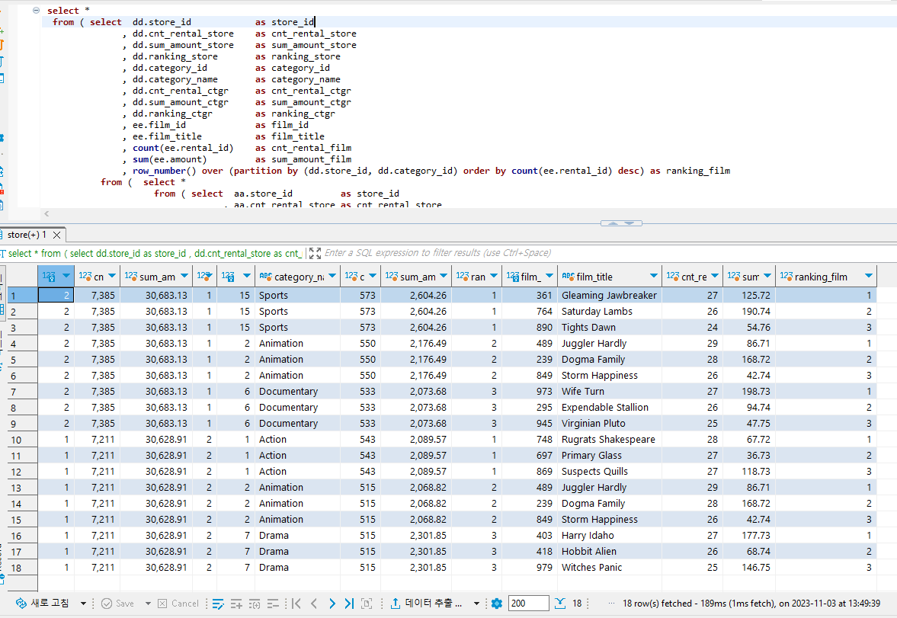

1. 저장소 별 대여 횟수를 순위를 지정해 출력하고, 해당 저장소 별 카테고리 대여 횟수 상위 3개를 출력 및 해당 카테고리 별 영화의 대여 횟수 상위 3개를 출력하세요.
(컬럼: 저장소ID, 대여 횟수, 총 매출액, 랭킹, 카테고리ID, 대여 횟수, 총 매출액, 랭킹, 영화ID, 대여 횟수, 총 매출액, 랭킹)

```sql
 select * 
  from ( select  dd.store_id			as store_id
		  	   , dd.cnt_rental_store	as cnt_rental_store
		  	   , dd.sum_amount_store	as sum_amount_store
		  	   , dd.ranking_store		as ranking_store
		  	   , dd.category_id			as category_id
		  	   , dd.category_name		as category_name
		  	   , dd.cnt_rental_ctgr		as cnt_rental_ctgr
		  	   , dd.sum_amount_ctgr		as sum_amount_ctgr
		  	   , dd.ranking_ctgr		as ranking_ctgr
		  	   , ee.film_id				as film_id
		  	   , ee.film_title			as film_title
		  	   , count(ee.rental_id)	as cnt_rental_film
		  	   , sum(ee.amount)			as sum_amount_film
		  	   , row_number() over (partition by (dd.store_id, dd.category_id) order by count(ee.rental_id) desc) as ranking_film
    	   from (  select *
			  		 from ( select  aa.store_id 		as store_id
								  , aa.cnt_rental_store as cnt_rental_store
								  , aa.sum_amount_store as sum_amount_store
								  , aa.ranking_store    as ranking_store
								  , bb.category_id	    as category_id
								  , bb.category_name	as category_name
								  , count(bb.rental_id) as cnt_rental_ctgr
								  , sum(bb.amount)	    as sum_amount_ctgr
								  , row_number() over (partition by aa.store_id order by count(bb.rental_id) desc) as ranking_ctgr
			  		   		   from ( select s.store_id         as store_id
										   , count(r.rental_id) as cnt_rental_store
										   , sum(p.amount) 		as sum_amount_store
										   , row_number() over (order by count(r.rental_id) desc) as ranking_store
							  			from rental r 
										     join payment   p on r.rental_id    = p.rental_id 
										     join inventory i on r.inventory_id = i.inventory_id 
										     join store     s on i.store_id     = s.store_id 
							 		   group by s.store_id
				   				    ) as aa
			       		    		join ( select s.store_id    as store_id
							       			    , c.category_id as category_id 
							       			    , c."name"  	as category_name
							       			    , r.rental_id   as rental_id
							       			    , p.amount 	    as amount
											 from rental r 
											  	  join payment 		  p on r.rental_id    = p.rental_id 
											  	  join inventory 	  i on r.inventory_id = i.inventory_id
											  	  join store 		  s on i.store_id     = s.store_id
											  	  join film_category fc on i.film_id      = fc.film_id 
											  	  join category 	  c on fc.category_id = c.category_id
								 		 ) as bb on aa.store_id = bb.store_id
						   group by aa.store_id
							      , aa.cnt_rental_store
								  , aa.sum_amount_store
								  , aa.ranking_store
								  , bb.category_id
								  , bb.category_name
				   		) as cc
				    where cc.ranking_ctgr <= 3
					order by cc.ranking_store
 				) as dd
 				join ( select  c.category_id as category_id
							 , f.film_id     as film_id
							 , f.title       as film_title
							 , r.rental_id   as rental_id
							 , p.amount 	 as amount
						  from rental r 
						       join payment 	   p on r.rental_id    = p.rental_id 
							   join inventory 	   i on r.inventory_id = i.inventory_id
							   join film_category fc on i.film_id      = fc.film_id 
							   join film 		   f on fc.film_id     = f.film_id 
							   join category 	   c on fc.category_id = c.category_id
 			 		) as ee on dd.category_id = ee.category_id
		 group by dd.store_id
		  	    , dd.cnt_rental_store
		  	    , dd.sum_amount_store
		  	    , dd.ranking_store
		  	    , dd.category_id
		  	    , dd.category_name
		  	    , dd.cnt_rental_ctgr
		  	    , dd.sum_amount_ctgr
		  	    , dd.ranking_ctgr
		  	    , ee.film_id
		  	    , ee.film_title
	  ) as ff
 where ff.ranking_film <= 3
 order by ff.ranking_store
 		, ff.ranking_ctgr
 		, ff.ranking_film
```

