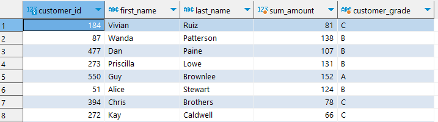
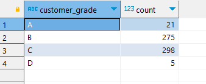

> GROUP BY에 대해 학습합니다.

1. store 별로 staff는 몇 명이 있는지 확인해 주세요.

```sql
select store_id , count(staff_id)
  from staff s 
 group by store_id
```

2. 영화 등급(rating) 별로 몇 개dml 영화를 가지고 있는지 확인해 주세요.

```sql
select rating, count(film_id)
  from film f 
 group by rating
```

3. 출연한 영화 배우가  10명 초과한 영화명은 무엇인가요?

```sql
select f.film_id , f.title
  from film f
       join film_actor fa on f.film_id = fa.film_id
 group by f.film_id 
       having count(fa.actor_id) > 10
 order by film_id 
```

...

13. 고객의 대여 금액 별 등급 별 고객 수를 구하세요.
A 등급은 151 이상 
B 등급은 101 이상 150 이하 
C 등급은 51  이상 100 이하
D 등급은 50  이하

고객 테이블과 고객 대여 금액을 기준으로 등급을 부여한 컬럼을 합친 쿼리를 먼저 작성해 줍니다.

```sql
select c.customer_id
	 , c.first_name 
	 , c.last_name 
	 , round(sum(p.amount)) as sum_amount
	 , case when round(sum(p.amount)) 	           >= 151 then 'A'
	 		when round(sum(p.amount)) between 101 and 150 then 'B'
	 		when round(sum(p.amount)) between 51  and 100 then 'C'
	 		else 'D'
	   end as customer_grade
  from customer c 
  join payment p on c.customer_id = p.customer_id 
 group by c.customer_id 
        , c.first_name 
        , c.last_name;
```



그리고 이를 인라인 뷰로 작성하고, <code>customer_grade</code>로 GROUP BY 해 주면 등급 별 고객 수를 구할 수 있습니다.

```sql
select db.customer_grade, count(*)
  from ( 
  	select c.customer_id
	 	 , c.first_name 
	 	 , c.last_name 
	 	 , round(sum(p.amount)) as 매출액
	 	 , case when round(sum(p.amount)) 	           >= 151 then 'A'
	 			when round(sum(p.amount)) between 101 and 150 then 'B'
	 			when round(sum(p.amount)) between 51  and 100 then 'C'
	 			else 'D'
	   	   end as customer_grade
  	  from customer c 
  	       join payment p on c.customer_id = p.customer_id 
 	 group by c.customer_id
            , c.first_name 
            , c.last_name
  ) as db
 group by db.customer_grade
 order by db.customer_grade
```



그리고 GROUP BY를 사용할 때, SELECT 절에 명시할 컬럼으로 꼭 GROUP BY 절에다 작성해 줘야 합니다.
예를 들어, 해당 쿼리는 postgresql에서 <code>customer_id</code>로 집계하고, SELECT 절에다 고객의 이름을 작성해도 정상 동작이 됩니다.
하지만 이는 오라클에서는 에러로 출력이 됩니다.

즉, DBMS에 따라 차이는 존재하는 것 같지만, 원래는 SELECT 절에 추출할 컬럼으로는 GROUP BY를 해 주는 것이 원칙입니다.