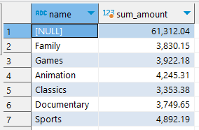
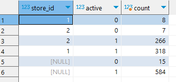
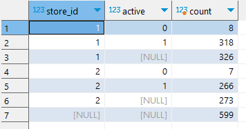

> ROLLUP, CUBE, GROUPING SETS에 대해 학습합니다.

1. 대여점 별 영화 재고 수량과 전체 영화 재고 수량을 구해주세요.

```sql
select c."name" , sum(p.amount) as sum_amount
  from payment p
       join rental         r on p.rental_id    = r.rental_id 
       join inventory      i on r.inventory_id = i.inventory_id 
       join film_category fc on i.film_id      = fc.film_id
       join category       c on fc.category_id = c.category_id 
 group by grouping sets ((c."name"), ())
```



...

9. 지점 별 + active 고객 수와, active 고객 수를 함께 보여주세요.

```sql
select c.store_id 
     , c.active 
     , count (c.customer_id)
  from customer c 
 group by grouping sets ( (c.store_id, c.active), (c.active) )
```



이는 <code>rollup</code>이나 <code>cube</code>가 아닌 <code>grouping sets</code>를 사용해 풀어야 합니다.
위 둘은 그룹으로 묶어준 컬럼들 외에 전체 집합도 추출하지만, grouping sets는 전체 집합을 구하지 않을 수 있기 때문입니다.

같은 문제를 rollup으로 풀이해 보면 다음과 같습니다.

```sql
select c.store_id 
     , c.active 
     , count (distinct customer_id)
  from customer c 
 group by rollup ( c.store_id, c.active )
```



rollup의 경우 다른 지정 없이도 전체를 집계한 컬럼을 추가해 출력합니다.

따라서 rollup과 cube, grouping sets를 비교해 보면 다음과 같습니다.

```sql
select a, b, count(*)
  from tbl
 group by rollup(a, b)
-- a, b의 합
-- a의 합
-- 전체 합

select a, b, count(*)
  from tbl
 group by cube(a, b)
-- a, b의 합
-- a의 합
-- b의 합
-- 전체 합

select a, b, count(*)
  from tbl
 group by grouping sets((a, b), (a))
-- a, b의 합
-- a의 합
-- 전체 합 원할 시, grouping sets 마지막에 ()로 한 번 더 묶어주기
```

