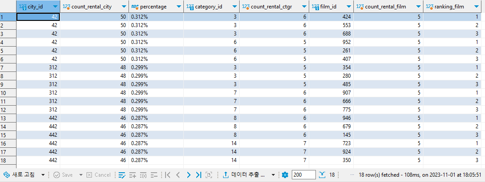

> ROW_NUMBER, RANK, DENSE_RANK 등 Analytical Function에 대해 학습합니다.

도시 별로 대여 횟수가 많은 상위 3개 도시의 도시 ID, 도시 대여 횟수, 대여 횟수의 비율을 출력하고, 해당 도시에 포함되는 카테고리 중 상위 두 개의 카테고리의 ID와 대여 횟수를 출력, 이어 해당 카테고리 각각에 포함되는 영화 중, 영화 별 대여 횟수가 상위 세 개인 영화의 ID와 대여 횟수 확인하세요.

```sql
select *
  from ( select ranking_ctgr.city_id	       as city_id	
		      , ranking_ctgr.count_rental_city as count_rental_city
		      , ranking_ctgr."percentage"      as percentage
			  , ranking_ctgr.category_id	   as category_id
			  , ranking_ctgr.count_rental_ctgr as count_rental_ctgr
		      , f.film_id 					   as film_id
			  , count (r3.rental_id)		   as count_rental_film
			  , row_number () over ( partition by (ranking_ctgr.city_id, ranking_ctgr.category_id) order by count (r3.rental_id) desc ) as ranking_film
		   from ( select ranking_city.city_id 			as city_id
					   , ranking_city.count_rental_city as count_rental_city
					   , round((( ranking_city.count_rental_city * 100 )::numeric / total_rental.total_rental), 3) || '%' as percentage
					   , c3.category_id 	  			as category_id
					   , count (r2.rental_id) 			as count_rental_ctgr
					   , row_number () over (partition by ranking_city.city_id order by count (r2.rental_id) desc )       as ranking_ctgr
			  		from ( select c2.city_id 			as city_id
						  		, count (r.rental_id)   as count_rental_city
						     from rental r 
						     join customer c  on r.customer_id = c.customer_id 
						     join address  a  on c.address_id  = a.address_id 
						     join city     c2 on a.city_id 	   = c2.city_id
						    group by c2.city_id 
						    order by "count_rental_city" desc
						    limit 3
				         ) as ranking_city
				    join address       a2 on ranking_city.city_id = a2.city_id 
				    join customer      c4 on a2.address_id        = c4.address_id 
				    join rental        r2 on c4.customer_id       = r2.customer_id  
				    join inventory     i2 on r2.inventory_id      = i2.inventory_id 
				    join film          f2 on i2.film_id           = f2.film_id 
				    join film_category fc on f2.film_id           = fc.film_id 
				    join category      c3 on fc.category_id       = c3.category_id
				    join ( select count(*) as total_rental from rental r4 ) as total_rental on 1 = 1
				   group by ranking_city.city_id
					 	  , ranking_city.count_rental_city
					 	  , "percentage"
					 	  , c3.category_id
				 ) as ranking_ctgr
	  join film_category fc2 on ranking_ctgr.category_id = fc2.category_id 
	  join film f 			 on fc2.film_id 			 = f.film_id 
	  join inventory i 		 on f.film_id 				 = i.inventory_id 
	  join rental r3 		 on i.inventory_id 			 = r3.inventory_id 
	 where ranking_ctgr.ranking_ctgr <= 2
	 group by ranking_ctgr.city_id
			, ranking_ctgr.count_rental_city
			, "percentage"
			, ranking_ctgr.category_id
			, ranking_ctgr.count_rental_ctgr
			, f.film_id
	 ) as ranking_film
 where ranking_film.ranking_film <= 3
 order by ranking_film.city_id
```

실행 결과는 다음과 같습니다.



다양한 Analytic Functions 중 랭크를 집계하는 기능은 대표적으로 <code>ROW_NUMBER</code>, <code>RANK</code>, <code>DENSE_RANK</code>가 있습니다. 예를 들어 1부터 10위까지 순위를 부여한다고 가정 시, <code>ROW_NUMBER</code>는 점수가 동일해도 1부터 10까지 차례대로 점수를 부여하고, <code>RANK</code>는 공동으로 점수가 부여되지만, 다음 순위는 이전 순위와 이어지지 않고 공동으로 부여된 순위를 무시합니다(예로 1등, 2등, 2등, 4등, ...). 마지막으로 <code>DENSE_RANK</code>는 공동으로 점수가 부여되며 다음 순위도 이전 순위와 이어 부여됩니다(예로 1등, 2등, 2등, 3등, ...).

다시 문제로 돌아와, 해당 문제는 대여 횟수가 많은 상위 3개 도시를 먼저 구하고, 그 3개 각각의 상위 2개의 카테고리를, 그리고 그 카테고리에서 각각 3개씩의 영화를 출력하기 때문에, 전체 데이터의 수는 3 X 2 X 3 해서 최소 18개가 나올 것입니다. 공동으로 순위가 부여되면 18 + a일 테지만, 해당 문제에서는 따로 어떤 Analytic Functions을 사용하란 말이 없어 임의로 중복을 제거하고자 <code>ROW_NUMBER</code>를 사용해 문제를 풀었습니다.

해당 문제는 마냥 

```sql
GROUP BY CITY_ID, CATEGORY_ID, FILM_ID
```

이처럼 풀면 원하는 답을 가져올 수 없습니다. 저희는 상위의 도시들을 먼저 구하고, 그 도시들 안에서 다시 카테고리를, 그리고 영화 수를 구해야 하기 때문에 인라인 뷰를 사용해 풀었습니다.

이어 이는 여러 개의 테이블을 만들어 JOIN 없이 WHERE 절로만 합치는 등 다양한 풀이 방식이 존재하고, 간소화 된 풀이 방식이 존재합니다. 하지만 현재 SQL 기본기와, 더 나아가 다양한 함수들을 응용해 쿼리문을 작성하는 단계이기 때문에, 처음에 꽂히고 시도하다 막힌 방식을 해결하는 데에 초점을 둬 작성했습니다.