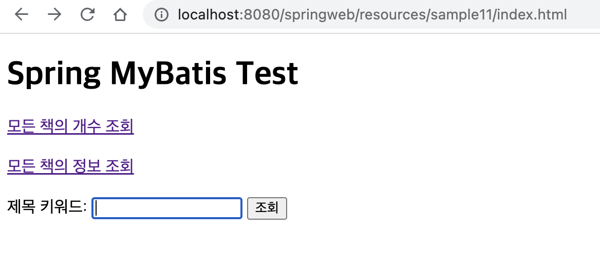

# Spring + MyBatis 예제

## VO
> Book.java

```java
package my.spring.springweb.sample11.vo;

import lombok.AllArgsConstructor;
import lombok.Data;
import lombok.NoArgsConstructor;

@Data
@NoArgsConstructor
@AllArgsConstructor
public class Book {
	private String bookIsbn;
	private String bookTitle;
	private String bookAuthor;
	private int bookPrice;
}

```

## Client
> index.html

```html
<!DOCTYPE html>
<html>
<head>
<meta charset="UTF-8">
<title>Insert title here</title>
</head>
<body>
	<h1>Spring MyBatis Test</h1>
	
	<a href="/springweb/book/count">모든 책의 개수 조회</a>
	<br><br>
	<a href="/springweb/book/all">모든 책의 정보 조회</a>
	<br><br>
	<form action="/springweb/book/search" method="post">
		제목 키워드: <input type="text" name="keyword">
		<input type="submit" value="조회">
	</form>
</body>
</html>
```



## Controller
> BookController.java

```java
package my.spring.springweb.sample11;

import org.springframework.beans.factory.annotation.Autowired;
import org.springframework.stereotype.Controller;
import org.springframework.ui.Model;
import org.springframework.web.bind.annotation.GetMapping;
import org.springframework.web.bind.annotation.PostMapping;
import org.springframework.web.bind.annotation.RequestMapping;
import org.springframework.web.bind.annotation.RequestParam;

import my.spring.springweb.sample11.dao.BookDao;

@Controller
@RequestMapping(value = "/book")
public class BookController {
	@Autowired

	private BookDao dao; // dao 자동 주입

	@GetMapping(value = "count")
	public String method1(Model model) {
		model.addAttribute("result1", dao.getBookCount());
		return "sample11/bookCount";
	}

	@GetMapping(value = "all")
	public String method2(Model model) {
		model.addAttribute("result2", dao.getAllBooks());
		return "sample11/bookCount";
	}

	@PostMapping(value = "search")
	public String method3(@RequestParam(value = "keyword") String keyword, Model model) {
		model.addAttribute("result3", dao.getSearchBooks(keyword));
		return "sample11/bookCount";
	}
}
```
## Service
> 해당 예제에서는 서비스 사용 X

## DAO
> BookDao 인터페이스 생성 후 구현해 개발

### BookDao.java
```java
package my.spring.springweb.sample11.dao;

import java.util.List;

import my.spring.springweb.sample11.vo.Book;

public interface BookDao {
	int getBookCount();
	List<Book> getAllBooks(); // 모든 책 정보 다 가져올 거라 List로 지정
	List<Book> getSearchBooks(String str);
}
```

### BookDaoImpl.java
```java
package my.spring.springweb.sample11.dao;

import java.util.List;

import org.apache.ibatis.session.SqlSession;
import org.springframework.beans.factory.annotation.Autowired;
import org.springframework.stereotype.Repository;

import my.spring.springweb.sample11.vo.Book;

@Repository
public class BookDaoImpl implements BookDao{
	
	@Autowired
	private SqlSession session;

	@Override
	public int getBookCount() {
		return session.selectOne("myBook.countBooks");
	}

	@Override
	public List<Book> getAllBooks() {
		return session.selectList("myBook.selectAll");
	}

	@Override
	public List<Book> getSearchBooks(String keyword) {
		return session.selectList("myBook.selectBookByKeyword", keyword);
	}
}
```

## Mapper
> BookMapper.xml
```xml
<?xml version="1.0" encoding="UTF-8"?>

<!DOCTYPE mapper
  PUBLIC "-//mybatis.org//DTD Mapper 3.0//EN"
  "http://mybatis.org/dtd/mybatis-3-mapper.dtd">

<mapper namespace="myBook">

   <select id="countBooks" resultType="int">
      select count(*) from book
   </select>

   <!-- resultMap의 일반적인 사용법 -->
   <resultMap id="result"
      type="my.spring.springweb.sample11.vo.Book">
      <result property="bookIsbn" column="bisbn" jdbcType="VARCHAR"
         javaType="String" />
      <result property="bookTitle" column="btitle" jdbcType="VARCHAR"
         javaType="String" />
      <result property="bookAuthor" column="bauthor" />
      <result property="bookPrice" column="bprice" />
   </resultMap>

   <select id="selectAll" resultMap="result">
       <![CDATA[   
         SELECT bisbn, btitle, bauthor, bprice
         FROM book         
      ]]>
   </select>

   <select id="selectBookByKeyword" parameterType="String"
      resultMap="result">
       <![CDATA[   
         SELECT bisbn, btitle, bauthor, bprice
         FROM book         
         WHERE btitle LIKE CONCAT('%', #{Keyword}, '%')
      ]]>
   </select>
</mapper>
```

## Client
> bookCount.jsp

```jsp
<%@ page language="java" contentType="text/html; charset=UTF-8"
	pageEncoding="UTF-8"%>
<%@ taglib uri="http://java.sun.com/jsp/jstl/core" prefix="c"%>
<%@ taglib uri="http://java.sun.com/jsp/jstl/fmt" prefix="fmt"%>

<!DOCTYPE html>
<html>
<head>
<meta charset="UTF-8">
<title>Insert title here</title>
</head>
<body>
	<h3>책 개수</h3>
	<h5>${ result1 }</h5>

	<br>
	<hr>
	<br>

	<h3>책 종류</h3>
	<table>
		<thead>
			<th>책 번호</th>
			<th>책 제목</th>
			<th>책 저자</th>
			<th>책 가격</th>
		</thead>

		<tbody>
			<c:forEach var="item" items="${ result2 }">
				<tr>
					<td>${ item.bookIsbn }</td>
					<td>${ item.bookTitle }</td>
					<td>${ item.bookAuthor }</td>
					<td>${ item.bookPrice }</td>
				<tr>
			</c:forEach>
		</tbody>
	</table>


	<br>
	<hr>
	<br>

	<h3>검색한 책</h3>
	<table>
		<thead>
			<th>책 번호</th>
			<th>책 제목</th>
			<th>책 저자</th>
			<th>책 가격</th>
		</thead>

		<tbody>
			<c:forEach var="item" items="${ result3 }">
				<tr>
					<td>${ item.bookIsbn }</td>
					<td>${ item.bookTitle }</td>
					<td>${ item.bookAuthor }</td>
					<td>${ item.bookPrice }</td>
				<tr>
			</c:forEach>
		</tbody>
	</table>
</body>
</html>
```

### 책 개수


### 책 종류


### 검색한 책
> 자바로 검색

